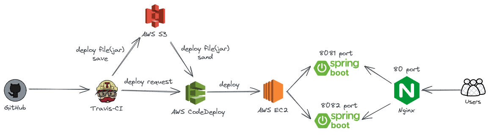

# 소개

- spring boot를 이용하여 게시판을 만들고 travis-ci, aws를 이용한 무중단 배포 및 CI/CD 진행

# 결과

> 사이트 : http://ec2-15-164-34-243.ap-northeast-2.compute.amazonaws.com/

> 2024년 2월 1일부터 프리티어를 제외한 공인 IPv4 주소와 Amazon VPC 등에서 요금이 부과된다고 한다.
외부 사이트의 요청으로 인해 데이터 베이스에 접근하려면 퍼블릭 주소가 필요한데, RDS에서 퍼블릭 주소를 열어놓으면 요금이 발생한다. 
따라서, 현재 RDS 퍼블릭 주소는 막아논 상태. 즉, **페이지 접속과 구글, 네이버 로그인은 가능**하지만 **게시글을 작성은 불가능**하다

# 아키텍처

### 배포 진행(상세)

1. git을 통해 커밋 후 github로 push
2. github에서 travis-ci로 CI/CD 요청
3. travis-ci에서 build 및 테스트 진행 > 빌드 및 테스트 실패 시 배포 X > 성공 or 실패 시 이메일을 통해 전달
4. 빌드 후 생성된 jar 파일과 appspec.yml(codeDeploy 에이전트가 사용하는 배포 관리 파일), 배포에 필요한 스크립트들을 압축하여 S3에 저장
5. codeDeploy는 S3에 저장된 압축 파일을 EC2에 설치된 codeDeploy 에이전트로 전달한다.
6. codeDeploy 에이전트는 압축된 파일을 해체하고 appspec.yml에 설정된 경로에 파일을 옮긴다.
7. appspec.yml에 걸린 hooks을 통해 스크립트 파일들을 실행하여 신규로 배포된 파일을 EC2 서버에 실행시킨다.
8. 정상적으로 실행되었다면 nginx를 통해 신규로 배포된 파일을 바라볼 수 있도록 포트를 변경한 뒤 reload를 진행한다.

현재 2개의 포트를 통해 무중단 배포를 진행하고 있으므로 새로운 기능을 붙여 배포해도 사용자 입장에서는 서비스가 끊기는 일 없이 이용이 가능하다.

# 회고

- 문제가 발생할 때마다 이슈를 등록시켜놓으니 동일한 문제가 발생했을 때 빠르게 처리할 수 있었음
- 무중단 배포가 어떻게 이뤄지는지 간접적으로 경험할 수 있었음
- 클라우드 배포에 필요한 AWS 서비스들이 어떻게 사용되는지 알 수 있었음 (EC2, RDS, codeDeploy, S3)

# 남은 문제

- Travis CI 를 통해 CI/CD를 구현해놨으나 한 달 뒤에 무료 버전이 종료(24.6.6) > 해당 날짜 이후, gitAction으로 변경 필요.
- 테스트 케이스에서 발생한 문제의 해결방법을 아직 모르겠음(이슈에 등록 상태). > 스프링에 대해 공부하자.

# 앞으로

- 프로그래머스에 백엔드 과제 테스트 진행 예정
- 해당 프로젝트를 통해 배운 것으로 '랜덤 채팅 서비스'를 개발해서 배포할 예정

# 출처

- 스프링 부트와 AWS로 혼자 구현하는 웹 서비스 (저자: 이동욱)
